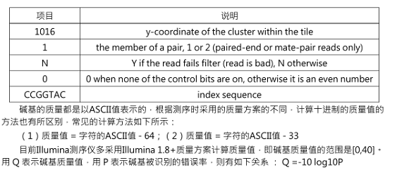

[toc]


# GATK SNP CALLING

This is a self pipeline for SNP calling by GATK Haplotypecaller.

Server: 172.22.49.66

softwares:

|  software  | version |
| :--------: | :-----: |
|  *fastp*   | 0.20.0  |
|   *bwa*    | 0.7.17  |
| *samtools* |   1.9   |
|  *picard*  | 2.22.0  |
|   *gatk*   | 4.1.5.0 |

[^Note]: While using unwrapped **<u>java</u>** version of ***picard*** and ***gatk***, the corresponding command lines should be changed.

------

## reads filter by *fastp*

```bash
fastp -w 5 -i PREFIX.R1.fastq -I PREFIX.R2.fastq -o PREFIX.R1.clean.fastq -O PREFIX.R2.clean.fastq -j PREFIX.json -h PREFIX.html -R "PREFIX reprot"

	-w, thread to use

Alternative options:
   -M, --cut_mean_quality               the mean quality requirement option(Q20) (int [=20])
   -q, --qualified_quality_phred        the quality value that a base is qualified. Default 15 means phred quality >=Q15 is qualified. (int [=15])
   -n, --n_base_limit                   if one read's number of N base is >n_base_limit, then this read/pair is discarded. Default is 5 (int [=5])
   -e, --average_qual                   if one read's average quality score <avg_qual, then this read/pair is discarded. Default 0 means no requirement (int [=0])  
```

------

## build index for reference genome by *bwa, samtools* and *picard*

```bash
bwa index REFERENCE_GENOME.fasta
samtools faidx REFERENCE_GENOME.fasta
picard CreateSequenceDictionary I=REFERENCE_GENOME.fasta O=REFERENCE_GENOME.dict
java -XX:ParallelGCThreads=4 -Xmx4g -jar picard.jar CreateSequenceDictionary -R REFERENCE_GENOME.fasta -O REFERENCE_GENOME.dict
```

------

## map by *bwa*

```bash
bwa mem -t 5 REFERENCE_GENOME.fasta PREFIX.R1.clean.fasta PREFIX.R2.clean.fasta -o PREFIX.sam 2>>PREFIX.err

	-t, thread to use
```

------

## convert sam files to bam format by *samtools*

```
samtools import REFERENCE_GENOME.fasta.fai PREFIX.sam PREFIX.bam
```

------

## filter bam by flags and sort by *samtools*

| Flags |               |                                                              |
| :---: | :-----------: | :----------------------------------------------------------- |
|   1   |    PAIRED     | paired-end (or multiple-segment) sequencing technology       |
|   2   |  PROPER_PAIR  | each segment properly aligned according to the aligner       |
|   4   |     UNMAP     | segment unmapped                                             |
|   8   |    MUNMPA     | next segment in the template unmapped                        |
|  16   |    REVERSE    | SEQ is reverse complemented                                  |
|  32   |   MREVERSE    | SEQ of the next segment in the template is reverse complemented |
|  64   |     READ1     | the first segment in the template                            |
|  128  |     READ2     | the last segment in the template                             |
|  256  |   SECONDARY   | secondary alignment                                          |
|  512  |    QCFAIL     | not passing quality controls                                 |
| 1024  |      DUP      | PCR or optical duplicate                                     |
| 2048  | SUPPLEMENTARY | supplementary alignment                                      |

```bash
samtools view -f 2 -b -@ 5 PREFIX.sorted.bam -o PREFIX.paired.bam

	-@, thread to use;
	-f, only include reads with all  of the FLAGs in INT present. 

samtools sort -@ 5 PREFIX.paired.bam -o PREFIX.sorted.bam

```

------

## add read group information by *picard*

[^Note]: Read group information in the raw reads file




```bash
picard -XX:ParallelGCThreads=4 -Xmx4g AddOrReplaceReadGroups I=PREFIX.paired.bam O=PREFIX.rgadded.bam SORT_ORDER=coordinate CREATE_INDEX=True VALIDATION_STRINGENCY=LENIENT RGSM=PREFIX RGID=A00268.1 RGPL=ILLUMINA RGLB=H2M7TDSXX.1 RGPU=A00268H2M7TDSXX.1 
```

------

## remove PCR duplicates

### remove duplicates by *picard*

```bash
picard MarkDuplicates I=PREFIX.rgadded.bam O=PREFIX.rmduped.bam M=PREFIX.metrics.txt CREATE_INDEX=true 
```

------

### remove duplicates by *samtools*

[^Note]: 从map完的步骤就不同了

```
samtools sort -n -o PREFIX.namesorted.bam PREFIX.bam
samtools fixmate -m PREFIX.namesorted.bam PREFIX.fixmated.bam
samtools sort -o PREFIX.positionsorted.bam PREFIX.fixmated.bam
samtools markdup -@ 20 PREFIX.positionsorted.bam PREFIX.markduped.bam
```


------

## realign indels by *gatk*

[^Note]: These tools are **NOT SUPPORT** by *gatk 4.0* and newer version. If use only Haplotypecaller to call SNP, this step can be skipped.

```bash
java -Xmx2g -XX:ParallelGCThreads=4 -jar GenomeAnalysisTKLite.jar -T RealignerTargetCreator -R REFERENCE_GENOME.fasta -I PREFIX.rmduped.bam -o PREFIX.intervals 
java -Xmx2g -XX:ParallelGCThreads=4 -jar GenomeAnalysisTKLite.jar -T IndelRealigner -R REFERENCE_GENOME.fasta -I PREFIX.rmduped.bam -targetIntervals PREFIX.intervals -o PREFIX.realigned.bam 
samtools index PREFIX.realigned.bam
```

------

## call SNP by *samtools*

[^Note]: This step can be skipped according to some research.

```bash
samtools mpileup -DSugf REFERENCE_GENOME.fasta -q 20 -Q 20 PREFIX1.rmduped.bam PREFIX2.rmduped.bam PREFIX3.rmduped.bam 2>>samtools.error.log | bcftools call -vmO v -f GQ -o cohort.samtools.raw.vcf 2>>samtools.error.log 
```

------

##  call SNP by *gatk*

```bash
gatk --java-options "-XX:ParallelGCThreads=2 -Xmx4g" HaplotypeCaller -R REFERENCE_GENOME.fasta -I PREFIX.rmduped.bam -O PREFIX.g.vcf.gz -ERC GVCF -bamout PREFIX.realigned.bam 2>>PREFIX.err
```

------

## Combine gvcfs by *gatk*

```bash
gatk --java-options "-XX:ParallelGCThreads=2 -Xmx4g" CombineGVCFs -R REFERENCE_GENOME.fasta -V PREFIX1.g.vcf.gz -V PREFIX2.g.vcf.gz -V PREFIXn.g.vcf.gz -O cohort.g.vcf.gz
```

------

## genotyping by *gatk*

```bash
gatk --java-options "-Xmx4g -XX:ParallelGCThreads=4" GenotypeGVCFs -R REFERENCE_GENOME.fasta -V cohort.g.vcf.gz -O all.vcf.gz
```

------

## extract SNPs and indels

```bash
gatk --java-options "-Xmx4g -XX:ParallelGCThreads=4" SelectVariants -R REFERENCE_GENOME.fasta -V all.vcf.gz -O SNPs.vcf -select-type SNP
gatk --java-options "-Xmx4g -XX:ParallelGCThreads=4" SelectVariants -R REFERENCE_GENOME.fasta -V all.vcf.gz -O INDELs.vcf.gz -select-type INDEL
```

------

## snp filtering

[^note]: The script will filter snps on scaffolds that shorter than 3000 bp, then output the listed filter information into corresponding files. Then we need select the filter threshold according to the distribution of all information. Recommendation filter threshold by *gatk*: `QUAL<30, QD<2, FS>60, SOR>3, MQ<40,MQRankSun<-12.5||MQRankSum>12.5, ReadPosRanSum<-8||ReadPosRanSum>8`

```perl
perl snp_filter_by_length+filter_info_statistic.pl SNPs.vcf snps.passed.vcf snps.unpassed.vcf -QD snps.QD.txt -RPRS snps.RPRS.txt -SOR snps.SOR.txt -MQRS snps.MQRS.txt -QUAL snps.QUAL.txt -MQ snps.MQ.txt -FS snps.FS.txt 
gatk --java-options "-Xmx4g -XX:ParallelGCThreads=4" VariantFiltration -R REFERENCE_GENOME.fasta -V snps.passed.vcf -O snps.filtered.vcf --filter-name "my_filter" --filter-expression "QUAL < 30.0 || FS > 40.0 || MQ < 40.0 || QD < 2.0 || MQRankSum < -2.0 || MQRankSum > 2.0 || ReadPosRankSum < -4.0 || ReadPosRankSum > 4.0 " 
```

------

## transform vcf file to genotype

[^Note]: Sites harboring **[ATCG]/\*** genotype will be exported to **snps.filtered.err1** file while tri-allelic sites will be exported to  **snps.filtered.err2** file.

```
perl vcf2geno.pl snps.filtered.vcf snps.filtered.geno snps.filtered.err1 snps snps.filtered.err2
```

------

## remove reserved deletions (**[ATCG]/\*** or **\*/\*** sites)

[^Note]: Remember to have a look at the percentage of these genotypes and sites in the dataset and how many sites were filtered.

```bash
grep -v '/\*' snps.filtered.geno | grep -v '\*/' >snps.final.geno
```

------

