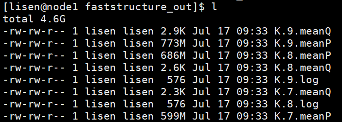

# 用snp数据做structure分析

|   software    | version |
| :-----------: | :-----: |
|     plink     |   1.9   |
| faststructure |   1.0   |


#### 1.用*plink*将vcf格式转化为bed格式

```
plink --vcf PREFIX.vcf --recode --out PREFIX --allow-extra-chr
plink --file PREFIX --allow-extra-chr --make-bed --out PREFIX
```

------

#### 2.运行*faststructure*

```
python structure.py -K <INT> --input=PREFIX --output=PREFIX --full --seed=100 --prior=logistic

	-K, 		number of populations
	--full, 	to output all variational parameters; optional
	--prior,	={simple,logistic}   (choice of prior; default: simple)
```

[^Note]: 生成文件的前缀是 PPREFIX.K.xxx,例如设置`K=3 --output=snps`，生成的文件前缀为`snps.3.`

------

#### 3.筛选最适K值

将同一database不同K值的生成文件放在同一个文件夹，如



```
python chooseK.py --input=faststructure/PREFIX
```

输出结果为：

```
Model complexity that maximizes marginal likelihood = 2
Model components used to explain structure in data = 2
```

[^Note]: 其中第一行的值应该是可以包括所有population类型的K值，第二个则是可以解释群体结构的K值

------

#### 4.画图

有两种选择，可以用excel根据`PREFIX.meanQ`中的比例画图，也可以用faststructure自带的脚本，但是对服务器有要求，命令如下：

```
python distruct.py -K <INT> --input=faststructure/PREFIX --output=faststructure/PREFIX.K.svg --title=<PREFIX K=> 

	--title=<figure title>  (a title for the figure; optional)
```

