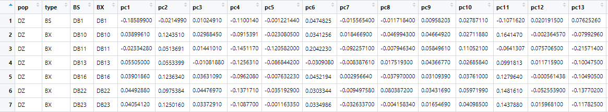

# 用snp数据画pca图

| 软件  | 版本 |
| :---: | :--: |
| plink | 1.9  |

------

#### 1.用***plink***做pca分析

运行完命令会生成四个文件，**snps.pca.eigenval**, **snps.pca.eigenvec**, **snps.pca.nosex**和**snps.pca.log**，其中**eigenvec**中储存了每个点的坐标信息，**eigenval**中是每种pc类型的解释度，这两个文件是后续用到的主要文件。

```
plink --vcf snps.vcf --pca -out snps.pca --allow-extra-chr
	--allow-extra-chr, plink的格式里有对于chr编号的格式要求，用这个命令可以允许其他格式的chr编号
```

------

#### 2.格式调整

主要是在**snps.pca.eigenvec**文件中加上两列，一列记录群体信息，一列作为颜色区分，在这里颜色主要是为了区分bs、bg和bx，然后加上title，示例如下：



------

#### 3.用r画图

```R
setwd("C:/Users/shi lab/Desktop/")
vec<-read.table("snps.all_filtered_plink.eigenvec",header=TRUE,sep=" ")
pdf("pca.pdf",width=4,height = 4)
ggplot(vec, aes(x=pc1, y=pc2, shape=pop, colour=type))+
  geom_point(size=5)+scale_shape_manual(values=c(15,16))+
  scale_colour_manual(values=c("#FF7473","#FFC952","#47B8E0"))+
  ggtitle("pca")+
  theme_bw()+
  theme(plot.title=element_text(hjust=0.5,size=rel(1.5),family="Times",face="bold.italic",color = "red"))
dev.off()
```

