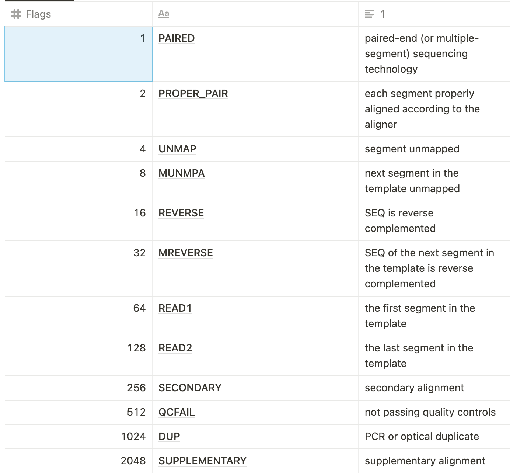
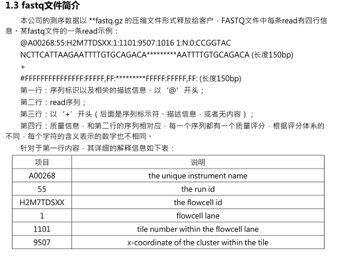
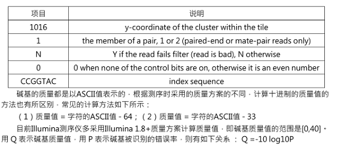

# GATK SNP CALLING


This is a self pipeline for SNP calling by GATK Haplotypecaller.

Server: 172.22.49.66

#### 0. softwares

| software | version |
| -------- | ------- |
| fastp    | 0.20.0  |
| bwa      | 0.17.17 |
| samtools | 1.14    |
| gatk     | 4.1.8.1 |
| picard   | 2.22.0  |

---

### 1. reads filter by *fastp*

```
fastp -w 5 -i PREFIX.R1.fastq -I PREFIX.R2.fastq -o PREFIX.R1.clean.fastq -O PREFIX.R2.clean.fastq -j PREFIX.json -h PREFIX.html -R "PREFIX reprot"
-w, thread to use
Alternative options:   
-M, --cut_mean_quality               the mean quality requirement option(Q20) (int [=20])   
-q, --qualified_quality_phred        the quality value that a base is qualified. Default 15 means phred quality >=Q15 is qualified. (int [=15])
-n, --n_base_limit                   if one read's number of N base is >n_base_limit, then this read/pair is discarded. Default is 5 (int [=5])
-e, --average_qual                   if one read's average quality score <avg_qual, then this read/pair is discarded. Default 0 means no requirement (int [=0])
```

---

### 2. build index for reference genome by *bwa, samtools* and *picard*

```
bwa index REFERENCE_GENOME.fasta
samtools faidx REFERENCE_GENOME.fasta
picard CreateSequenceDictionary R=REFERENCE_GENOME.fasta O=REFERENCE_GENOME.dict
```

---

### 3. map by *bwa*

```
bwa mem -t 5 REFERENCE_GENOME.fasta PREFIX.R1.clean.fasta PREFIX.R2.clean.fasta -o PREFIX.sam 2>>PREFIX.err
-t, thread to use
```

---

### 4. convert sam files to bam format by *samtools*

```
samtools import REFERENCE_GENOME.fasta.fai PREFIX.sam PREFIX.bam
```

---

### 5. filter bam by flags and sort by *samtools*



```
samtools view -f 2 -b -@ 5 PREFIX.bam -o PREFIX.paired.bam    
-@, thread to use;
-f, only include reads with all  of the FLAGs in INT present.
samtools sort -@ 5 PREFIX.paired.bam -o PREFIX.sorted.bam
```

---

### 6. add read group information by *picard*






```
picard -XX:ParallelGCThreads=4 -Xmx4g AddOrReplaceReadGroups I=PREFIX.sorted.bam O=PREFIX.rgadded.bam SORT_ORDER=coordinate CREATE_INDEX=True VALIDATION_STRINGENCY=LENIENT RGSM=PREFIX RGID=A00268.1 RGPL=ILLUMINA RGLB=H2M7TDSXX.1 RGPU=A00268H2M7TDSXX.1
```

---

### 7-1. remove duplicates by *picard*

这里有人提出单端数据可以用samtools，双端数据用picard更好

```
picard -XX:ParallelGCThreads=4 -Xmx4g MarkDuplicates I=PREFIX.rgadded.bam O=PREFIX.rmduped.bam M=PREFIX.metrics.txt CREATE_INDEX=true
```

---

### 7-2. remove duplicates by *samtools*

```
samtools sort -n -o PREFIX.namesorted.bam PREFIX.bam
samtools fixmate -m PREFIX.namesorted.bam PREFIX.fixmated.bam
samtools sort -o PREFIX.positionsorted.bam PREFIX.fixmated.bam
samtools markdup -@ 20 PREFIX.positionsorted.bam PREFIX.markduped.bam
```

---

### 8. realign indels by *gatk*

```
java -Xmx2g -XX:ParallelGCThreads=4 -jar GenomeAnalysisTKLite.jar -T RealignerTargetCreator -R REFERENCE_GENOME.fasta -I PREFIX.rmduped.bam -o PREFIX.intervals
java -Xmx2g -XX:ParallelGCThreads=4 -jar GenomeAnalysisTKLite.jar -T IndelRealigner -R REFERENCE_GENOME.fasta -I PREFIX.rmduped.bam -targetIntervals PREFIX.intervals -o PREFIX.realigned.bam
samtools index PREFIX.realigned.bam
```

---

### 9. call SNP by *samtools*

```
samtools mpileup -DSugf REFERENCE_GENOME.fasta -q 20 -Q 20 PREFIX1.rmduped.bam PREFIX2.rmduped.bam PREFIX3.rmduped.bam 2>>samtools.error.log | bcftools call -vmO v -f GQ -o cohort.samtools.raw.vcf 2>>samtools.error.log
```

---

### 10. call SNP by *gatk*

```
gatk --java-options "-XX:ParallelGCThreads=2 -Xmx4g" HaplotypeCaller -R REFERENCE_GENOME.fasta -I PREFIX.rmduped.bam -O PREFIX.g.vcf.gz -ERC GVCF -bamout PREFIX.realigned.bam 2>>PREFIX.err
```

---

### 11. Combine gvcfs by *gatk*

```
gatk --java-options "-XX:ParallelGCThreads=2 -Xmx4g" CombineGVCFs -R REFERENCE_GENOME.fasta -V PREFIX1.g.vcf.gz -V PREFIX2.g.vcf.gz -V PREFIXn.g.vcf.gz -O cohort.g.vcf.gz
```

---

### 12. genotyping by *gatk*

```
gatk --java-options "-Xmx4g -XX:ParallelGCThreads=4" GenotypeGVCFs -R REFERENCE_GENOME.fasta -V cohort.g.vcf -O all.vcf
```

---

### 13. extract SNPs and indels

```
gatk --java-options "-Xmx4g -XX:ParallelGCThreads=4" SelectVariants -R REFERENCE_GENOME.fasta -V all.vcf.gz -O snps.vcf -select-type SNP
gatk --java-options "-Xmx4g -XX:ParallelGCThreads=4" SelectVariants -R REFERENCE_GENOME.fasta -V all.vcf -O indels.vcf -select-type INDEL
```

---

### 14. snp filtering

- 对各个统计量进行统计
  
    ```bash
    nohup bcftools query -f "%QD\n" snps.vcf | perl -pe 's/^\.\n$//' >snps.QD &
    nohup bcftools query -f "%QUAL\n" snps.vcf | perl -pe 's/^\.\n$//' >snps.QUAL &
    nohup bcftools query -f "%FS\n" snps.vcf | perl -pe 's/^\.\n$//' >snps.FS &
    nohup bcftools query -f "%MQ\n" snps.vcf | perl -pe 's/^\.\n$//' >snps.MQ &
    nohup bcftools query -f "%MQRankSum\n" snps.vcf | perl -pe 's/^\.\n$//' >snps.MQRankSum &
    nohup bcftools query -f "%ReadPosRankSum\n" snps.vcf | perl -pe 's/^\.\n$//' >snps.ReadPosRankSum &
    nohup bcftools query -f "%QD\n" snps.vcf | perl -pe 's/^\.\n$//' >snps.QD &
    ```
    
- R plot看分布
  
    ```r
    library(ggplot2)
    library(scales)
    pdf("snpfilter.pdf")
    snp_QD <- read.table("snps.QD",header = FALSE)
    names(snp_QD) <- ("snps_QD")
    ggplot(aes(x=snps_QD),data=snp_QD)+ geom_density()
    
    snp_MQ <- read.table("snps.MQ",header = FALSE)
    names(snp_MQ) <- ("snps_MQ")
    ggplot(aes(x=snps_MQ),data=snp_MQ)+ geom_density()
    
    snp_FS <- read.table("snps.FS",header = FALSE)
    names(snp_FS) <- ("snps_FS")
    ggplot(aes(x=snps_FS),data=snp_FS)+ geom_density()+scale_x_log10(breaks=10^(0:2),labels=trans_format("log10",math_format(10^.x)))
    
    snp_QUAL <- read.table("snps.QUAL",header = FALSE)
    names(snp_QUAL) <- ("snps_QUAL")
    ggplot(aes(x=snps_QUAL),data=snp_QUAL)+ geom_density()+xlim(0,300)
    
    snp_MQRankSum <- read.table("snps.MQRankSum",header = FALSE)
    names(snp_MQRankSum) <- ("snps_MQRankSum")
    ggplot(aes(x=snps_MQRankSum),data=snp_MQRankSum)+ geom_density()+xlim(-10,10)
    
    snp_ReadPosRankSum <- read.table("snps.ReadPosRankSum",header = FALSE)
    names(snp_ReadPosRankSum) <- ("snps_ReadPosRankSum")
    ggplot(aes(x=snps_ReadPosRankSum),data=snp_ReadPosRankSum)+ geom_density()+xlim(-10,10)
    
    snp_SOR <- read.table("snps.SOR",header = FALSE)
    names(snp_SOR) <- ("snps_SOR")
    ggplot(aes(x=snps_SOR),data=snp_SOR)+ geom_density()+xlim(0,10)
    
    dev.off()
    
    pdf("indelfilter.pdf")
    indel_QD <- read.table("indels.QD",header = FALSE)
    names(indel_QD) <- ("indels_QD")
    ggplot(aes(x=indels_QD),data=indel_QD)+ geom_density()
    
    indel_MQ <- read.table("indels.MQ",header = FALSE)
    names(indel_MQ) <- ("indels_MQ")
    ggplot(aes(x=indels_MQ),data=indel_MQ)+ geom_density()
    
    indel_FS <- read.table("indels.FS",header = FALSE)
    names(indel_FS) <- ("indels_FS")
    ggplot(aes(x=indels_FS),data=indel_FS)+ geom_density()+scale_x_log10(breaks=10^(0:2),labels=trans_format("log10",math_format(10^.x)))
    
    indel_QUAL <- read.table("indels.QUAL",header = FALSE)
    names(indel_QUAL) <- ("indels_QUAL")
    ggplot(aes(x=indels_QUAL),data=indel_QUAL)+ geom_density()
    
    indel_MQRankSum <- read.table("indels.MQRankSum",header = FALSE)
    names(indel_MQRankSum) <- ("indels_MQRankSum")
    ggplot(aes(x=indels_MQRankSum),data=indel_MQRankSum)+ geom_density()+xlim(-10,10)
    
    indel_ReadPosRankSum <- read.table("indels.ReadPosRankSum",header = FALSE)
    names(indel_ReadPosRankSum) <- ("indels_ReadPosRankSum")
    ggplot(aes(x=indels_ReadPosRankSum),data=indel_ReadPosRankSum)+ geom_density()+xlim(-10,10)
    
    indel_SOR <- read.table("indels.SOR",header = FALSE)
    names(indel_SOR) <- ("indels_SOR")
    ggplot(aes(x=indels_SOR),data=indel_SOR)+ geom_density()+xlim(0,10)
    
    dev.off()
    ```
    
- 根据分布确定filter条件，具体的filter条件设定可以参考gatk官网的[hard filter推荐参数](https://gatk.broadinstitute.org/hc/en-us/articles/360035890471-Hard-filtering-germline-short-variants)和[hard filter介绍](https://gatk.broadinstitute.org/hc/en-us/articles/360035531112--How-to-Filter-variants-either-with-VQSR-or-by-hard-filtering)
  
    ```bash
    gatk --java-options "-Xmx4g -XX:ParallelGCThreads=4" VariantFiltration -R REFERENCE_GENOME.fasta -V snps.vcf -O snps.filtered.vcf -filter "QD < 2.0" --filter-name "QD2" -filter "QUAL < 30.0" --filter-name "QUAL30" -filter "SOR > 3.0" --filter-name "SOR3" -filter "FS > 60.0" --filter-name "FS60" -filter "MQ < 40.0" --filter-name "MQ40" -filter "MQRankSum < -2.5" --filter-name "MQRankSum-2.5" -filter "MQRankSum > 2.5" --filter-name "MQRankSum2.5"  -filter "ReadPosRankSum < -8.0" --filter-name "ReadPosRankSum-8" -filter "ReadPosRankSum > 8.0" --filter-name "ReadPosRankSum8"
    ```
    

---

### 15. transform vcf file to genotype

```
perl vcf2geno.pl snps.filtered.vcf snps.filtered.geno snps.filtered.err1 snps snps.filtered.err2
```

---

### 16. remove reserved deletions (**[ATCG]/*** or **/*** sites)

```
grep -v '/\*' snps.filtered.geno | grep -v '\*/' >snps.final.geno
```

---